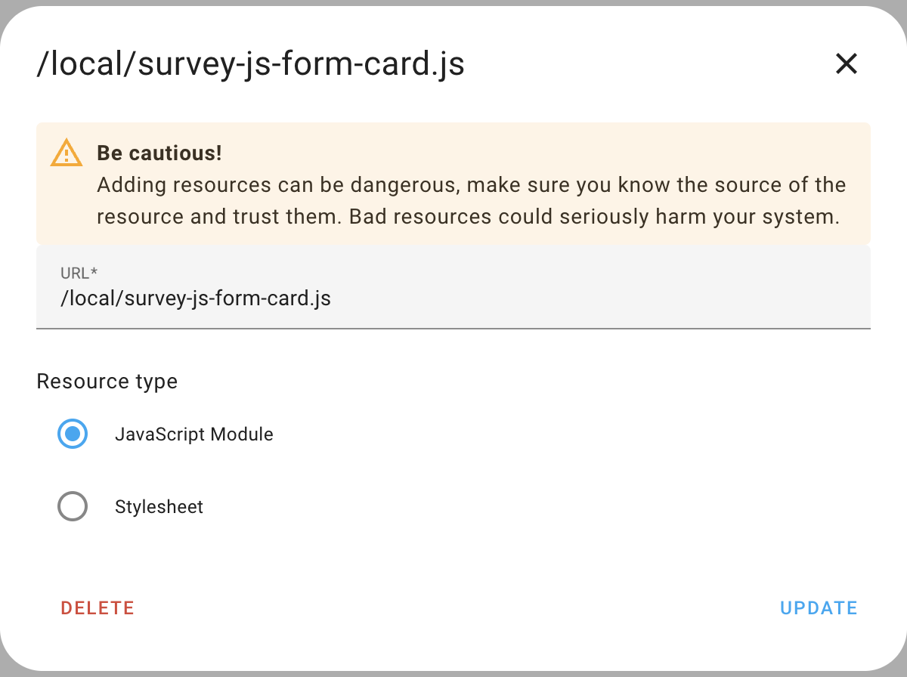
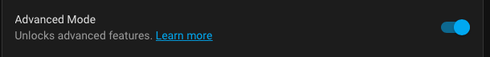
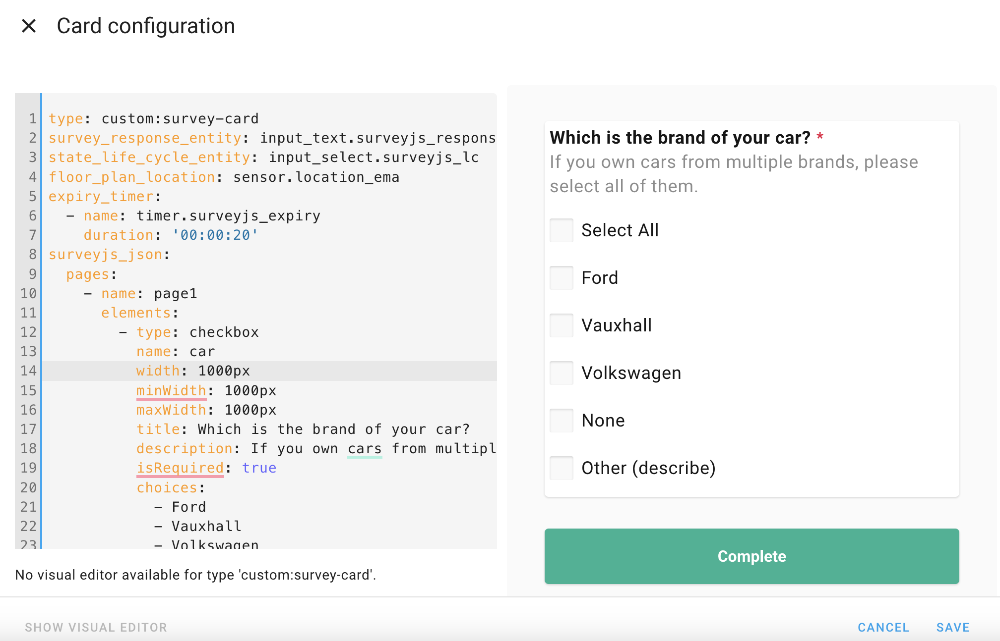
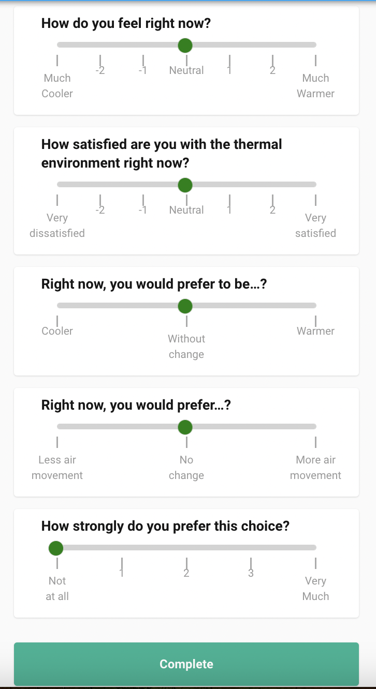

# SurveyJs Form Card

The SurveyJS Form Card is a custom integration for [Home Assistant][home-assistant] that allows you to embed dynamic and interactive surveys or forms within Home Assistant cards. This integration leverages the powerful SurveyJS library to create, manage, and display forms, enabling users to collect and process data directly from their Home Assistant dashboards.

---

- @published: May 2023
- @author: Manikanta Reddy Thikkavarapu

[![hacs][hacs-badge]][hacs-url]
[![release][release-badge]][release-url]
![downloads][downloads-badge]

# Installation

### HACS

SurveyJs Form Card is available in [HACS][hacs] (Home Assistant Community Store).

1. Install HACS if you don't have it already
2. Open HACS in Home Assistant
3. Go to "Frontend" section
4. Search for "SurveyJs Form Card" and download the card

### Manual

1. Download `dist/survey-js-form-card.js` file from the [latest release][release-url].
2. Put `survey-js-form-card.js` file into your `config/www` folder.
3. Add reference to `survey-js-form-card.js` in Dashboard.

   - **Using UI:** _Settings_ → _Dashboards_ → _More Options icon_ → _Resources_ → _Add Resource_ → Set _Url_ as `/local/survey-js-form-card.js` → Set _Resource type_ as `JavaScript Module`.



   - **Note:** If you do not see the Resources menu, you will need to enable _Advanced Mode_ in your _User Profile_



# Usage

### Entities & Helpers

SurveyJs card totally depends on 1 entity and 3 helpers:

1. input_select: [`Documentation`](https://www.home-assistant.io/integrations/input_select/)
   - Input select helper is used to monitor surveyjs lifecycle state changes; anytime the state of the Input select entity changes, the same state change is triggered in the surveyjs sensor entity.
2. input_text: [`Documentation`](https://www.home-assistant.io/integrations/input_text/)
   - Input text helper is used to store surveyjs form response.
3. timer: [`Documentation`](https://www.home-assistant.io/integrations/timer/)
   - Timer helper is used for two purposes in our project, one is for countdown timer for surveyjs form submission and another one is for notification timer
4. Sensor **_[Optional]_**: [`Documentation 1`](https://www.home-assistant.io/integrations/sensor/) & [`Documentation 2`](https://developers.home-assistant.io/docs/core/entity/sensor/)
   - Sensor entity is used to store floor plan location

**Note**: The reason for using helper functions instead of sensor entities for all purposes is that state changes with sensor entities are not permanent and data is not saved in the homeassistant database.

### Card Configuration

Go to a dashboard. Use the three dots in the upper right hand corner to edit the
dashboard. Take control if required. Click **_+ ADD CARD_**. At the bottom
select **_Manual_** to add a custom card.

In surveyjs card configuration, three properties are required:

1. type: Specifies the type of the custom card.
2. entity: Connects the card to a specific entity within Home Assistant.
3. surveyjs_json: Defines the survey configuration in JSON format.

Note:
## How to Create the Survey Configuration JSON

To create the survey configuration JSON for use in your Home Assistant card, follow these steps:

1. **Design Your Survey:**
   - Go to the [SurveyJS Survey Creator](https://surveyjs.io/create-free-survey).
   - Use the Survey Creator to design your survey form.

2. **Copy the JSON Configuration:**
   - Once you have finished designing your survey, click on the "JSON Editor" tab in the Survey Creator.
   - You will see the JSON representation of your survey. Copy this JSON configuration.

3. **Paste JSON into Home Assistant Card Configuration:**
   - Go to your Home Assistant configuration.
   - Open the custom card configuration where you want to include the survey.
   - Paste the copied JSON configuration into your Home Assistant card configuration.




In the card configuration enter:

```yaml
type: custom:survey-card # Specifies that this card is a custom card named 'survey-card'
survey_response_entity: input_text.surveyjs_response # Links the card to an input_text entity to store survey responses
state_life_cycle_entity: input_select.surveyjs_lc # Links the card to an input_select entity to monitor survey lifecycle state changes
floor_plan_location: sensor.location_ema # (Optional) Links the card to a sensor entity that stores floor plan location
expiry_timer: # Specifies the configuration for the expiry timer
  - name: timer.surveyjs_expiry # Defines the name of the timer used for the survey expiration
    duration: '00:00:20' # Sets the duration of the expiry timer to 20 seconds
surveyjs_json: # Contains the JSON configuration for the survey
  {
    "pages":
      [
        {
          "name": "page1",
          "elements":
            [
              {
                "type": "checkbox",
                "name": "car",
                "width": "1000px",
                "minWidth": "1000px",
                "maxWidth": "1000px",
                "title": "Which is the brand of your car?",
                "description": "If you own cars from multiple brands, please select all of them.",
                "isRequired": true,
                "choices": ["Ford", "Vauxhall", "Volkswagen"],
                "separateSpecialChoices": true,
                "showOtherItem": true,
                "showNoneItem": true,
                "colCount": 2,
                "showSelectAllItem": true,
              },
            ],
        },
      ],
    "showQuestionNumbers": "off",
  }
```

If everything went well so far, congratulations! You should now see the output of the first card you created yourself.



# Development server

Set up home assistant development environment by following this github documentation: [Development Environment](https://github.com/home-assistant-tutorials/01.development-environment)

Once setup is done, go to Home Assistant instance http://localhost:8123 and start configuration.

### Install

In another terminal, install dependencies and run development server:

```sh
npm install
```

### Build

You can build the `survey-js-form-card.js` file in `dist` folder by running the build command.

```sh
npm run build
```

### Update

Now you can copy the bundled `survey-js-form-card.js` file from `dist` folder and paste it inside your `config/www` folder and reload Home Assistant server for updates.

# Help

Feel free to open an issue if something is not working as expected.

[](https://github.com/NEU-ABLE-LAB/SurveyJs-HomeAssistant-Card/issues)

Got questions or thoughts about SurveyJs Form Card? Want to share your dashboards or discoveries? You can go on the GitHub Discussions section.

[](https://github.com/NEU-ABLE-LAB/SurveyJs-HomeAssistant-Card/discussions)

For further deep-dive into the code go to `docs/code-explainer.md`

<!-- Badges -->

[hacs-url]: https://github.com/hacs/integration
[hacs-badge]: https://img.shields.io/badge/hacs-default-orange.svg?style=flat-square
[release-badge]: https://img.shields.io/github/v/release/NEU-ABLE-LAB/SurveyJs-HomeAssistant-Card?style=flat-square
[downloads-badge]: https://img.shields.io/github/downloads/NEU-ABLE-LAB/SurveyJs-HomeAssistant-Card/total?style=flat-square

<!-- References -->

[home-assistant]: https://www.home-assistant.io/
[hacs]: https://hacs.xyz
[release-url]: https://github.com/NEU-ABLE-LAB/SurveyJs-HomeAssistant-Card/releases
