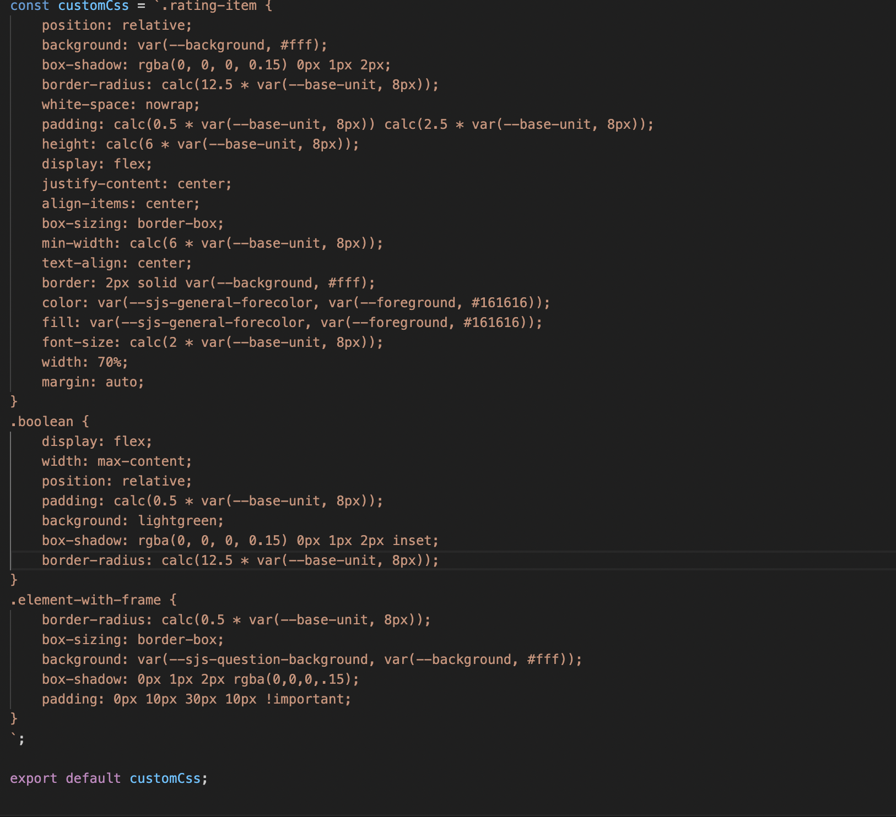
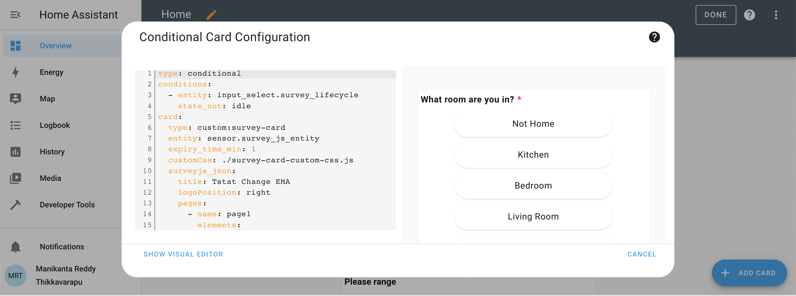
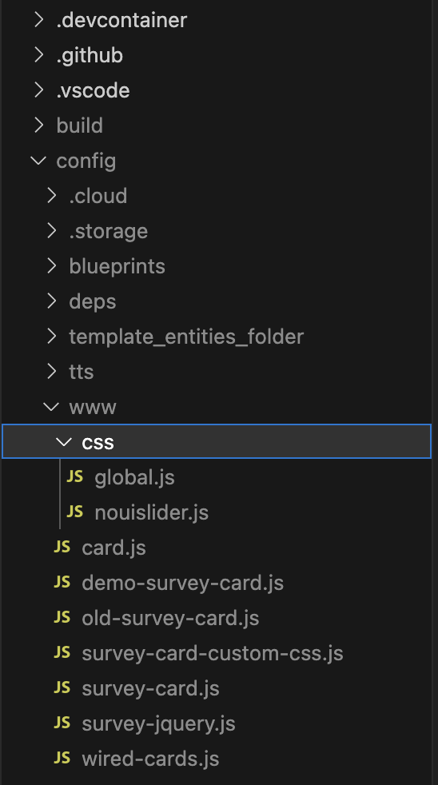
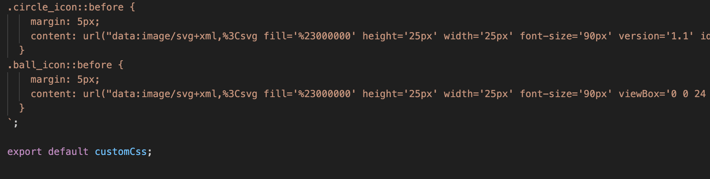
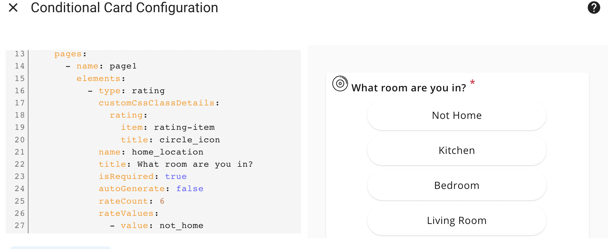

## The Card Code

Find the code in the file named `survey-js-form-card.js` alongside with this README.

### A custom element

The card has to be a [***custom
element***](https://developer.mozilla.org/en-US/docs/Web/Web_Components/Using_custom_elements).
The class inherits from [`LitElement`](https://lit.dev).

```js
class SurveyCard extends LitElement {
```

### Visit the Official Documentation

You should know [the official
documentation](https://developers.home-assistant.io/docs/frontend/custom-ui/custom-card),
too. This tutorial is based upon it.

## Running the Code

### Adding the Ressource

Open your admin account of the development environment in the web browser. Did
you already unlock **Advanced Mode**?


Go to ***Settings*** > ***Dashboard***. Click the three dots in the upper right
hand corner to open ***Resources***. Click ***ADD RESOURCE*** in the lower right
hand corner.

As the URL enter `/local/survey-js-form-card.js`. Choose ***JavaScript Module*** and submit.


### Using the Card

Go to a dashboard. Use the three dots in the upper right hand corner to edit the
dashboard. Take control if required. Click ***+ ADD CARD***. At the bottom
select ***Manual*** to add a custom card.


In the card configuration enter:

```yaml
type: conditional
conditions:
  - entity: input_select.survey_lifecycle
    state_not: idle
card:
  type: custom:survey-card
  entity: sensor.survey_js_entity
  expiry_time_min: 1
  customCss: ./survey-card-custom-css.js
  surveyjs_json:
    title: Tstat Change EMA
    logoPosition: right
    pages:
      - name: page1
        elements:
          - type: rating
            customCssClassDetails:
              rating:
                item: rating-item
                title: circle_icon
            name: home_location
            title: What room are you in?
            isRequired: true
            autoGenerate: false
            rateCount: 6
            rateValues:
              - value: not_home
                text: Not Home
              - value: kitchen
                text: Kitchen
              - value: bedroom
                text: Bedroom
              - value: living_room
                text: Living Room
              - value: office
                text: Office
              - value: other
                text: Other
            displayMode: buttons
          - type: boolean
            customCssClassDetails:
              boolean:
                item: boolean
            name: others_home
            visibleIf: '{home_location} <> ''not_home'' and {home_location} notempty'
            title: Are other people home with you now?
            isRequired: true
        title: Contextual
      - name: page2
        elements:
          - type: rating
            customCssClassDetails:
              rating:
                item: rating-item
            name: sensation
            visibleIf: '{home_location} <> ''not_home'''
            title: Right now, you feel
            isRequired: true
            autoGenerate: false
            rateValues:
              - value: cold
                text: Cold
              - value: cool
                text: Cool
              - value: neutral
                text: Neutral
              - value: warm
                text: Warm
              - value: hot
                text: Hot
            displayMode: buttons
          - type: rating
            customCssClassDetails:
              rating:
                item: sd-rating__item
                title: ball_icon
            name: preference
            visibleIf: '{home_location} <> ''not_home'''
            title: 'Right now, you would prefer to be:'
            isRequired: true
            autoGenerate: false
            rateCount: 3
            rateValues:
              - value: cooler
                text: Cooler
              - value: no_change
                text: No Change
              - value: warmer
                text: Warmer
            displayMode: buttons
          - type: rating
            customCssClassDetails:
              rating:
                item: sd-rating__item
            name: discomfort_length
            visibleIf: >-
              {home_location} <> 'not_home' and {preference} <> 'no_change' and
              {preference} notempty
            title: How long have you experienced thermal discomfort?
            isRequired: true
            autoGenerate: false
            rateValues:
              - value: Item 1
                text: Just Now
              - value: Item 2
                text: 15min
              - value: Item 3
                text: 30min
              - value: Item 4
                text: 1h
              - value: Item 5
                text: 2h+
            displayMode: buttons
          - type: rating
            customCssClassDetails:
              rating:
                item: rating-item
            name: comfort_length
            visibleIf: >-
              {home_location} <> 'not_home' and {preference} = 'no_change' and
              {preference} notempty
            title: How long have you been comfortable?
            isRequired: true
            autoGenerate: false
            rateValues:
              - value: Item 1
                text: Just Now
              - value: Item 2
                text: 15min
              - value: Item 3
                text: 30min
              - value: Item 4
                text: 1h
              - value: Item 5
                text: 2h+
            displayMode: buttons
        title: Thermal Experience
      - name: page3
        elements:
          - type: rating
            name: impact_preference
            visibleIf: >-
              ((({home_location} != 'not_home') and ({impact_sensation} != 'No
              Change')) and notempty {impact_sensation})
            title: Changing the thermostat made my thermal comfort
            isRequired: true
            autoGenerate: false
            rateCount: 3
            rateValues:
              - Increase
              - No Change
              - Decrease
            rateMin: -1
            rateMax: 1
            displayMode: buttons
        title: Behavior
      - name: page6
        elements:
          - type: panel
            name: panel2
            elements:
              - type: image
                name: question2
                imageFit: cover
                imageHeight: auto
                imageWidth: 100%
              - type: rating
                name: question4
                title: Your Thermal Comfort
                defaultValueExpression: '"0"'
                isRequired: true
                rateMin: -2
                rateMax: 2
              - type: rating
                name: question3
                title: Someone Else's Thermal Comfort
                defaultValueExpression: '"0"'
                isRequired: true
                rateMin: -2
                rateMax: 2
              - type: rating
                name: question8
                title: Financial Considerations
                defaultValueExpression: '"0"'
                isRequired: true
                rateMin: -2
                rateMax: 2
              - type: rating
                name: question7
                title: Societal or Environmental Considerations
                defaultValueExpression: '"0"'
                isRequired: true
                rateMin: -2
                rateMax: 2
            visibleIf: >-
              ((({home_location} != 'not_home') and ({impact_sensation} != 'No
              Change')) and notempty {impact_sensation})
            title: >-
              Which of the following encouraged or discouraged you from changing
              the thermostat?
            isRequired: true
        title: Behavio Motivation
    showTitle: false
    showPageTitles: false
    showQuestionNumbers: 'off'
    questionErrorLocation: bottom
    questionTitlePattern: numTitl

```

Don't forget the `custom` prefix, as you add a custom card. The type of the card
is the type you did register in the last line of the `card.js` file:

```js
customElements.define("survey-card", SurveyCard);
```

If everything went well so far, congratulations! You should now see the output of the first card you created yourself. Try different entities.


### Survey Js Form Card Explained

```js
import {
  LitElement,
  html,
} from "https://unpkg.com/lit-element@2.0.1/lit-element.js?module";
import "https://unpkg.com/nouislider/dist/nouislider.min.js";
import "https://unpkg.com/jquery";
import { nouisliderStyles } from "./css/nouislider.js";
import { globalStyles } from "./css/global.js";

class SurveyCard extends LitElement {
  static get properties() {
    return {
      config: { type: Object },
    };
  }

  setConfig(config) {
    console.log("Config", this, config);
    this.config = config;
    this.survey = null;
    this.survey_timer = null;
    this.survey_state = "";
    this.customCss = "";
    this.getCustomCss();

    setTimeout(() => {
      if (
        this._hass?.states["input_select.survey_lifecycle"]?.state === "sent" ||
        this._hass?.states["input_select.survey_lifecycle"]?.state === "started"
      ) {
        this.startTimer(
          this._hass.states["input_select.survey_lifecycle"].state
        );
      } else {
        clearInterval(this.survey_timer);
        console.log("Interval Cleared");
      }
      console.log(this.survey_timer);
    }, 500);
  }

  set hass(hass) {
    console.log("Hass", hass);
    this._hass = hass;
  }

  firstUpdated() {
    console.log("Hi", this.config);
    var thisNode = this;
    $(document).ready(function () {
      console.log("Jquery working");
      $.getScript("https://unpkg.com/survey-jquery/survey.jquery.min.js").done(
        (script, textStatus) => {
          console.log(thisNode);
          thisNode.constructSurveyUI();
        }
      );
      $.getScript(
        "https://unpkg.com/surveyjs-widgets@1.9.90/surveyjs-widgets.min.js"
      ).done((script, textStatus) => {
        console.log("Survey JS Widgets loaded");
      });
    });
  }

  async getCustomCss() {
    const customCss = this.config?.customCss;
    if (customCss) {
      this.customCss = await import(this.config?.customCss);
      let style = this.shadowRoot.createElement("style");
      style.innerHTML = this.customCss?.default;
      this.shadowRoot.prepend(style);
    }
  }

  startTimer(state) {
    var countDownDate;
    if (state == "sent") {
      countDownDate = new Date();
      countDownDate.setMinutes(
        countDownDate.getMinutes() + this.config.expiry_time_min
      );
      // this._hass.callService("input_select.select_option", "started", {
      //   entity_id: "input_select.survey_lifecycle",
      // });

      this._hass.callApi("POST", "states/input_select.survey_lifecycle", {
        state: "started",
      });

      setTimeout(() => {
        this._hass.callApi("POST", "states/" + this.config.entity, {
          state: "started",
          attributes: {
            start_timer_date: countDownDate.getTime(),
          },
        });
      }, 500);
    } else if (state == "started") {
      this._hass.callApi("GET", "states/" + this.config.entity).then((data) => {
        console.log("Get Entity Data", data);
        countDownDate = new Date(data.attributes.start_timer_date);
      });
    }

    var thisHassNode = this;

    this.survey_timer = setInterval(function () {
      var now = new Date().getTime();

      var distance = countDownDate - now;

      if (distance < 0) {
        clearInterval(thisHassNode.survey_timer);
        thisHassNode.survey_state = "received";
        thisHassNode.survey.doComplete();
      }
    }, 1000);
  }

  constructSurveyUI() {
    var thisNode = this;
    window["surveyjs-widgets"].nouislider(Survey);
    console.log("Script accesed", Survey, "Config", this.config, noUiSlider);

    this.survey = new Survey.Model(this.config.surveyjs_json);
    console.log(
      "Survey Model",
      this.survey,
      this.survey.visiblePages,
      this.survey.currentPageNo
    );

    console.log(this.config.surveyjs_json);

    this.survey.onUpdateQuestionCssClasses.add(function (_, options) {
      thisNode.pageCssLogic(options);
    });

    this.survey_state = "received";

    this.survey.onComplete.add((sender) => {
      const results = {
        user_name: this._hass.user.name,
        survey_trigger: "Temp Change",
        survey_response: sender.data,
      };

      this._hass
        .callApi("POST", "states/" + this.config.entity, {
          state: this.survey_state,
          attributes: results,
        })
        .then((data) => {
          console.log("Post Entity Data", data);
          clearInterval(this.survey_timer);
          let thank_you_element =
            this.shadowRoot.querySelector(".sd-completedpage");
          thank_you_element.innerText =
            "Thank you for your response! Click here to return home.";
          thank_you_element.style.cursor = "pointer";
          thank_you_element.onclick = function () {
            window.location.href = "/";
          };
          setTimeout(() => {
            // this._hass.callService("input_select.select_option", "idle", {
            //   entity_id: "input_select.survey_lifecycle",
            // });
            // this._hass.callApi("POST", "states/input_select.survey_lifecycle", {
            //   state: "idle",
            // });
            window.location.href = "/";
          }, 2000);
        });
    });

    $(this.shadowRoot.getElementById("surveyElement")).Survey({
      model: this.survey,
    });
  }

  pageCssLogic(options) {
    console.log(options, "Custom CSS", options.question.getType());

    let elementsData;
    if (this.config.surveyjs_json?.elements) {
      console.log("Only one element");
      elementsData = this.config.surveyjs_json?.elements;
    } else {
      elementsData =
        this.config.surveyjs_json?.pages[this.survey?.currentPageNo]?.elements;
    }
    for (let ele of elementsData) {
      if (
        options.question.getType() == ele.type &&
        options.question.fullTitle == ele.title &&
        ele?.customCssClassDetails
      ) {
        // this.survey.css = ele?.customCssClassDetails;

        const classes = options.cssClasses;
        const classKey = Object.keys(
          Object.values(ele?.customCssClassDetails)[0]
        );
        const classValue = Object.values(
          Object.values(ele?.customCssClassDetails)[0]
        );

        this.cssClassUpdation(classes, classKey, classValue, ele.type);

        // classes[classKey] = classValue;

        console.log(
          "Available",
          ele.type,
          this.survey.css,
          ele?.customCssClassDetails
        );
        break;
      }
    }
  }

  cssClassUpdation(classes, classKey, classValue, questionType) {
    console.log(classes, classKey, classValue, questionType, "Classes");
    classKey.forEach((v, i) => {
      if (questionType == "rating" && v == "title") {
        classes[v] = classes[v].replace("sd-question__title", classValue[i]);
      } else {
        classes[v] = classValue[i];
      }
    });
  }

  render() {
    return html`
      <link
        rel="stylesheet"
        href="https://unpkg.com/survey-jquery@1.9.84/defaultV2.min.css"
      />
      <link
        rel="stylesheet"
        href="https://unpkg.com/nouislider/dist/nouislider.min.css"
      />
      <div id="surveyElement"></div>
    `;
  }

  static get styles() {
    console.log(this.config);
    return [nouisliderStyles, globalStyles];
  }
}

customElements.define("survey-card", SurveyCard);
```

## Imports

We need import below mentioned packages [Lit & JQuery] initially.

```js
import { LitElement, html,
} from "https://unpkg.com/lit-element@2.0.1/lit-element.js?module";
import "https://unpkg.com/nouislider/dist/nouislider.min.js";
import "https://unpkg.com/jquery";
import { nouisliderStyles } from "./css/nouislider.js";
import { globalStyles } from "./css/global.js";
```

## Functions

a) SurveyJs Lit component 

```js
class SurveyCard extends LitElement {
}
customElements.define("survey-card", SurveyCard);
```

b) Initialize variables

```js
  static get properties() {
    return {
      config: { type: Object },
    };
  }
```

d) Config setters [Similar to general constructor]

- Initializing few variables
- API call to get entity details

```js
  setConfig(config) {
    console.log("Config", this, config);
    this.config = config;
    this.survey = null;
    this.survey_timer = null;
    this.survey_state = "";
    this.customCss = "";
    this.getCustomCss();

    setTimeout(() => {
      if (
        this._hass?.states["input_select.survey_lifecycle"]?.state === "sent" ||
        this._hass?.states["input_select.survey_lifecycle"]?.state === "started"
      ) {
        this.startTimer(
          this._hass.states["input_select.survey_lifecycle"].state
        );
      } else {
        clearInterval(this.survey_timer);
        console.log("Interval Cleared");
      }
      console.log(this.survey_timer);
    }, 500);
  }
```

e) Hass setter

```js
  set hass(hass) {
    console.log("Hass", hass);
    this._hass = hass;
  }
```

f) First updated [the official documentation](https://lit.dev/docs/v1/components/lifecycle/#firstupdated)

We are importing the survey jquery and widgets package here rather than at the beginning since these cdn packages are asynchronous and we need to ensure that jquery is loaded first before importing surveyjs jquery and widgets.

```js
  firstUpdated() {
    console.log("Hi", this.config);
    var thisNode = this;
    $(document).ready(function () {
      console.log("Jquery working");
      $.getScript("https://unpkg.com/survey-jquery/survey.jquery.min.js").done(
        (script, textStatus) => {
          console.log(thisNode);
          thisNode.constructSurveyUI();
        }
      );
      $.getScript(
        "https://unpkg.com/surveyjs-widgets@1.9.90/surveyjs-widgets.min.js"
      ).done((script, textStatus) => {
        console.log("Survey JS Widgets loaded");
      });
    });
  }
```

g) Constructing SurveyJs UI [the official documentation](https://surveyjs.io/form-library/documentation/get-started-jquery)

```js
  constructSurveyUI() {
    var thisNode = this;
    window["surveyjs-widgets"].nouislider(Survey);
    console.log("Script accesed", Survey, "Config", this.config, noUiSlider);

    this.survey = new Survey.Model(this.config.surveyjs_json);
    console.log(
      "Survey Model",
      this.survey,
      this.survey.visiblePages,
      this.survey.currentPageNo
    );

    console.log(this.config.surveyjs_json);

    this.survey.onUpdateQuestionCssClasses.add(function (_, options) {
      thisNode.pageCssLogic(options);
    });

    this.survey_state = "received";

    this.survey.onComplete.add((sender) => {
      const results = {
        user_name: this._hass.user.name,
        survey_trigger: "Temp Change",
        survey_response: sender.data,
      };

      this._hass
        .callApi("POST", "states/" + this.config.entity, {
          state: this.survey_state,
          attributes: results,
        })
        .then((data) => {
          console.log("Post Entity Data", data);
          clearInterval(this.survey_timer);
          let thank_you_element =
            this.shadowRoot.querySelector(".sd-completedpage");
          thank_you_element.innerText =
            "Thank you for your response! Click here to return home.";
          thank_you_element.style.cursor = "pointer";
          thank_you_element.onclick = function () {
            window.location.href = "/";
          };
          setTimeout(() => {
            // this._hass.callService("input_select.select_option", "idle", {
            //   entity_id: "input_select.survey_lifecycle",
            // });
            // this._hass.callApi("POST", "states/input_select.survey_lifecycle", {
            //   state: "idle",
            // });
            window.location.href = "/";
          }, 2000);
        });
    });

    $(this.shadowRoot.getElementById("surveyElement")).Survey({
      model: this.survey,
    });
  }
```

h) Timer logic

We are utilizing a countdown timer so that the user can submit their response before the timer expires.

```js
  startTimer(state) {
    var countDownDate;
    if (state == "sent") {
      countDownDate = new Date();
      countDownDate.setMinutes(
        countDownDate.getMinutes() + this.config.expiry_time_min
      );
      // this._hass.callService("input_select.select_option", "started", {
      //   entity_id: "input_select.survey_lifecycle",
      // });

      this._hass.callApi("POST", "states/input_select.survey_lifecycle", {
        state: "started",
      });

      setTimeout(() => {
        this._hass.callApi("POST", "states/" + this.config.entity, {
          state: "started",
          attributes: {
            start_timer_date: countDownDate.getTime(),
          },
        });
      }, 500);
    } else if (state == "started") {
      this._hass.callApi("GET", "states/" + this.config.entity).then((data) => {
        console.log("Get Entity Data", data);
        countDownDate = new Date(data.attributes.start_timer_date);
      });
    }

    var thisHassNode = this;

    this.survey_timer = setInterval(function () {
      var now = new Date().getTime();

      var distance = countDownDate - now;

      if (distance < 0) {
        clearInterval(thisHassNode.survey_timer);
        thisHassNode.survey_state = "received";
        thisHassNode.survey.doComplete();
      }
    }, 1000);
  }
```

i) Custom css

Custom css file content: 



Whatever name will be given to the custom css file, same name should be declared in the home assistant configuration editor like below:



Need to declare a property name called customCssClassDetails at every question level in the configurations. 
 
Follow the below syntax:

```yaml
elements: 

          - type: rating 

            customCssClassDetails: 

              rating: 

                item: rating-item 

            name: home_location 

            title: What room are you in? 

            isRequired: true 

            autoGenerate: false 

            rateCount: 6 

          - type: boolean 

            customCssClassDetails: 

              boolean: 

                item: boolean 

            name: others_home 

            visibleIf: '{home_location} <> ''not_home'' and {home_location} notempty' 

            title: Are other people home with you now? 

            isRequired: true 

        title: Contextual 
```

In the above code structure, syntax for the customCssClassDetails is as follows:

YAML Format 

        customCssClassDetails: 
          rating: 
            item: rating-item 

Or

JSON Format 

customCssClassDetails { 
      rating: { 
      item: rating-item   
    } 
} 

Explanation: 
 
rating: {  -->  Question type 

} 

item: rating-item --> class key : new css class name  
 
To use the original css class name just replace the new one with the original css class name. 
 

customCssClassDetails { 
      rating: { 
      item: sd-rating__item  
    } 
}s

Global Css Usage:



As in the above screenshot, you can declare the global and module level css javascript files in the css folder. 

Custom icons: 
 
Define the custom icon css classes in the custom css js file like below:



And declare the icon css accordingly at a question level



```js
  pageCssLogic(options) {
    console.log(options, "Custom CSS", options.question.getType());

    let elementsData;
    if (this.config.surveyjs_json?.elements) {
      console.log("Only one element");
      elementsData = this.config.surveyjs_json?.elements;
    } else {
      elementsData =
        this.config.surveyjs_json?.pages[this.survey?.currentPageNo]?.elements;
    }
    for (let ele of elementsData) {
      if (
        options.question.getType() == ele.type &&
        options.question.fullTitle == ele.title &&
        ele?.customCssClassDetails
      ) {
        // this.survey.css = ele?.customCssClassDetails;

        const classes = options.cssClasses;
        const classKey = Object.keys(
          Object.values(ele?.customCssClassDetails)[0]
        );
        const classValue = Object.values(
          Object.values(ele?.customCssClassDetails)[0]
        );

        this.cssClassUpdation(classes, classKey, classValue, ele.type);

        // classes[classKey] = classValue;

        console.log("Available", ele.type, this.survey.css, ele?.customCssClassDetails);
        break;
      }
    }
  }
```

i) UI render

```js
  render() {
    return html` 
      <link rel="stylesheet" href="https://unpkg.com/survey-jquery@1.9.84/defaultV2.min.css"/>
      <link rel="stylesheet"
        href="https://unpkg.com/nouislider/dist/nouislider.min.css"/>
      <div id="surveyElement"></div>
    `;
  }
```

j) CSS

Use the custom imported nouislider and global variables.

```js
  static get styles() {
    console.log(this.config);
    return [nouisliderStyles, globalStyles];
  }
```