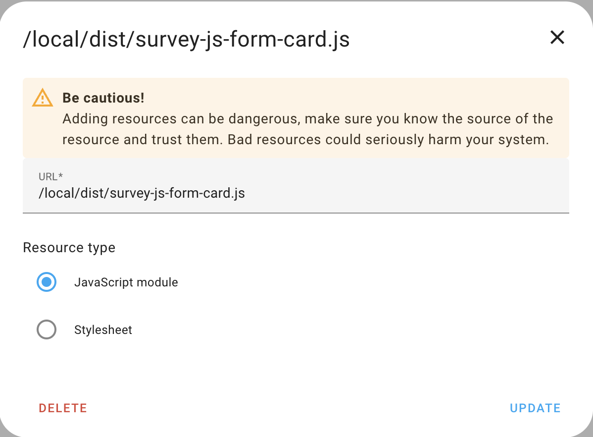
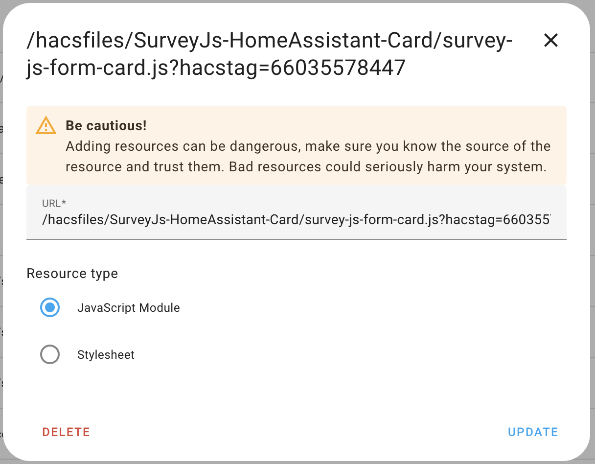
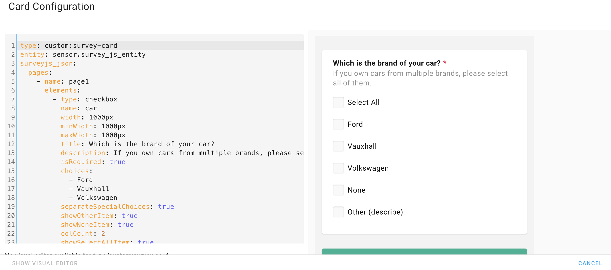
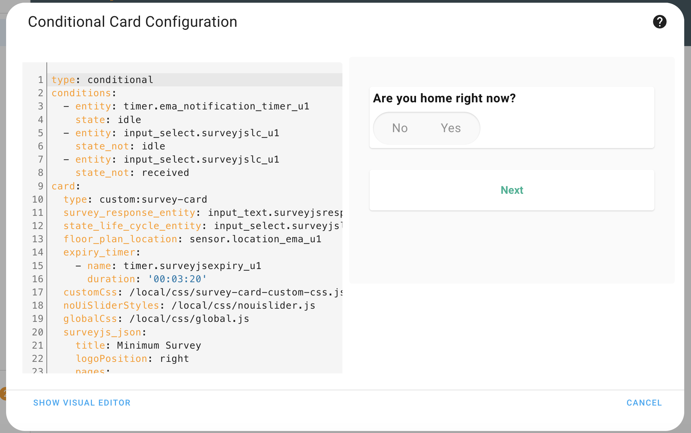
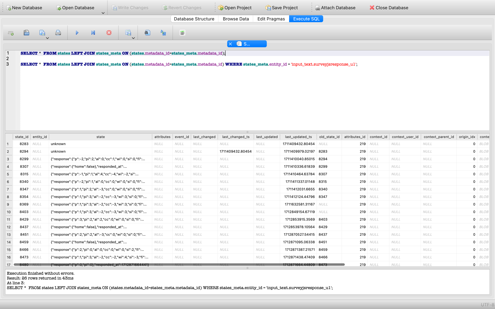
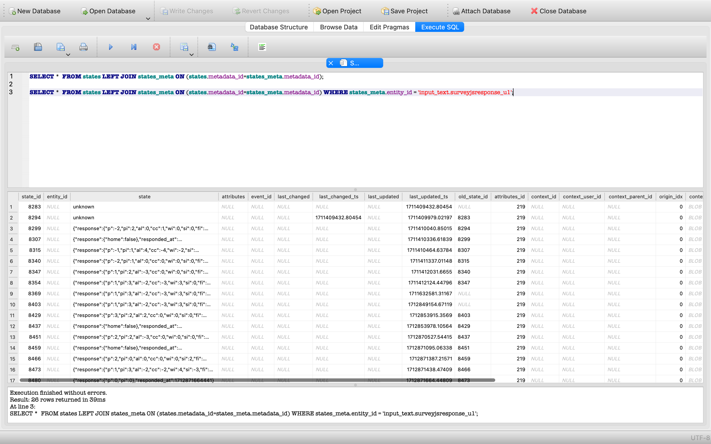

## The Card Code

Find the code in the file named `survey-js-form-card.js` alongside with this README.

### A custom element

The card has to be a [***custom
element***](https://developer.mozilla.org/en-US/docs/Web/Web_Components/Using_custom_elements).
The class inherits from [`LitElement`](https://lit.dev).

```js
class SurveyCard extends LitElement {
```

### Visit the Official Documentation
You should know [the official
documentation](https://developers.home-assistant.io/docs/frontend/custom-ui/custom-card),
too. This tutorial is based upon it.

## Running the Code

### Adding the Ressource

Open your admin account of the development environment in the web browser. Did
you already unlock **Advanced Mode**?


Go to ***Settings*** > ***Dashboard***. Click the three dots in the upper right
hand corner to open ***Resources***. Click ***ADD RESOURCE*** in the lower right
hand corner.

##### Development
As the URL enter `/local/survey-js-form-card.js`. Choose ***JavaScript Module*** and submit.



##### Production
As the URL enter `/hacsfiles/SurveyJs-HomeAssistant-Card/survey-js-form-card.js?hacstag=66035578447`. Choose ***JavaScript Module*** and submit.



### Using the Card

Go to a dashboard. Use the three dots in the upper right hand corner to edit the
dashboard. Take control if required. Click ***+ ADD CARD***. At the bottom
select ***Manual*** to add a custom card.



In the card configuration enter:

```yaml
type: custom:survey-card
entity: sensor.survey_js_entity
surveyjs_json: {
 "pages": [
  {
   "name": "page1",
   "elements": [
    {
     "type": "checkbox",
     "name": "car",
     "width": "1000px",
     "minWidth": "1000px",
     "maxWidth": "1000px",
     "title": "Which is the brand of your car?",
     "description": "If you own cars from multiple brands, please select all of them.",
     "isRequired": true,
     "choices": [
      "Ford",
      "Vauxhall",
      "Volkswagen"
     ],
     "separateSpecialChoices": true,
     "showOtherItem": true,
     "showNoneItem": true,
     "colCount": 2,
     "showSelectAllItem": true
    }
   ]
  }
 ],
 "showQuestionNumbers": "off"
}
```

1. type: custom:survey-card (Don't forget the `custom` prefix to custom element card & `custom:survey-card` name should match with whatever name we give below) -> 
```js
customElements.define("survey-card", SurveyCard);
```
2. entity: sensor.survey_js_entity (Here you need to mention whatever entity you are using)
3. surveyjs_json: Copy paste the survey json

```json
{
 "pages": [
  {
   "name": "page1",
   "elements": [
    {
     "type": "checkbox",
     "name": "car",
     "width": "1000px",
     "minWidth": "1000px",
     "maxWidth": "1000px",
     "title": "Which is the brand of your car?",
     "description": "If you own cars from multiple brands, please select all of them.",
     "isRequired": true,
     "choices": [
      "Ford",
      "Vauxhall",
      "Volkswagen"
     ],
     "separateSpecialChoices": true,
     "showOtherItem": true,
     "showNoneItem": true,
     "colCount": 2,
     "showSelectAllItem": true
    }
   ]
  }
 ],
 "showQuestionNumbers": "off"
}
```
4. Save the changes

Note:
How to create the json ?
Answer: Use surveyjs survey creation link -> [`Survey Creator`](https://surveyjs.io/create-free-survey)

If everything went well so far, congratulations! You should now see the output of the first card you created yourself. Try different entities.


### Entities & Helpers

SurveyJs card totally depends on 1 entity and 3 helpers:

1) Sensor: [`Documentation 1`](https://www.home-assistant.io/integrations/sensor/) & [`Documentation 2`](https://developers.home-assistant.io/docs/core/entity/sensor/)
    * Sensor entity is used to store floor plan location
2) input_select: [`Documentation`](https://www.home-assistant.io/integrations/input_select/)
    * Input select helper is used to monitor surveyjs lifecycle state changes; anytime the state of the Input select entity changes, the same state change is triggered in the surveyjs sensor entity.
3) input_text: [`Documentation`](https://www.home-assistant.io/integrations/input_text/)
    * Input text helper is used to store surveyjs form response.
4) timer: [`Documentation`](https://www.home-assistant.io/integrations/timer/)
    * Timer helper is used for two purposes in our project, one is for countdown timer for surveyjs form submission and another one is for notification timer

Note: The reason for using helper functions instead of sensor entities for all purposes is that state changes with sensor entities are not permanent and data is not saved in the homeassistant database.

Declare entities and helpers in the homeassistant card configuration editor like in the below image:



### Custom css and icon

Custom css file content: 


Declare customCss variable in the home assistant configuration editor like below:


Need to declare a property name called customCssClassDetails at every question level in the configurations. 
 
Follow the below syntax:

```yaml
        elements:
          - type: nouislider
            customCssClassDetails:
              nouislider:
                item: column
                withFrame: element-with-frame
            title: Right now, you would prefer to be...
            defaultValueExpression: '0'
            hideNumber: true
            name: p
            step: '1'
            inputTYpe: range
            rangeMin: '-4'
            rangeMax: '4'
            pipsMode: values
            pipsValues:
              - -4
              - -3
              - -2
              - -1
              - 0
              - 1
              - 2
              - 3
              - 4
            pipsText:
              - value: -4
                text: Much <br> Cooler
              - value: 0
                text: No <br> Change
              - value: 4
                text: Much <br> Warmer
            tooltips: false
```

In the above code structure, syntax for the customCssClassDetails is as follows:

YAML Format 

    customCssClassDetails:
      nouislider:
        withFrame: element-with-frame

Or

JSON Format 

customCssClassDetails { 
    nouislider: { 
      withFrame: element-with-frame
    } 
} 

Explanation: 
 
nouislider: {  -->  Question type 

} 

withFrame: element-with-frame --> class key : new css class name  
 
To use the original css class name just replace the new one with the original css class name. 
 

customCssClassDetails { 
      nouislider: { 
      withFrame: sd-element--with-frame  
    } 
}

Global Css Usage:


As in the above screenshot, you can declare the global and module level css javascript files in the css folder.

###  Mark Down Images

Apply markdown image path beside any text like below

title:  What room are you in?

Output:


### Page cache removal

When new custom css modifications are posted to the HACS github repository, the old changes are not reflected by removing the cached page.
 
 Below is the code to remove page cache
 
 ```js
      this.customCss = await import(
        this.config?.customCss + "?" + Math.random()
      );
      this.noUiSliderStyles = await import(
        this.config?.noUiSliderStyles + "?" + Math.random()
      );
      this.globalCss = await import(
        this.config?.globalCss + "?" + Math.random()
      );
 ```

 ### Homeassistant DB:

 To check the stored data we can also check it in the SQL IDE's by importing the home-assistant_v2.db file

 Query 1: 

 SELECT *  FROM states LEFT JOIN states_meta ON (states.metadata_id=states_meta.metadata_id);

 

 Query 2:  
 
SELECT *  FROM states LEFT JOIN states_meta ON (states.metadata_id=states_meta.metadata_id) WHERE states_meta.entity_id = 'input_text.surveyjsresponse_u1';

 