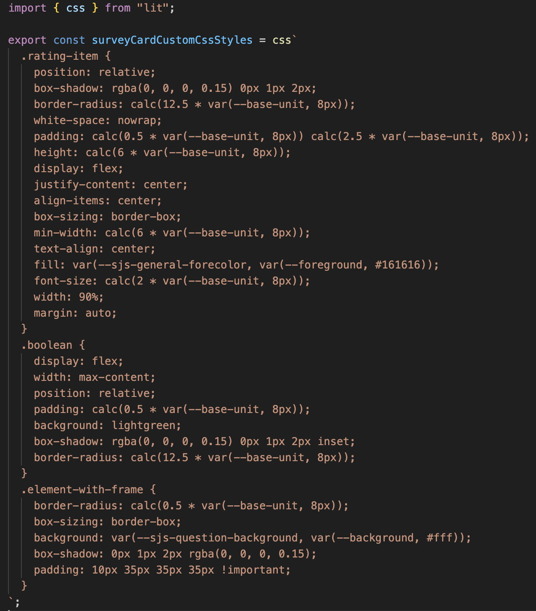

## The Card Code

## Test TODO

Find the code in the file named `survey-js-form-card.js` alongside with this README.

### A custom element

The card has to be a [***custom
element***](https://developer.mozilla.org/en-US/docs/Web/Web_Components/Using_custom_elements).
The class inherits from [`LitElement`](https://lit.dev).

```js
class SurveyCard extends LitElement {
```

### Visit the Official Documentation
You should know [the official
documentation](https://developers.home-assistant.io/docs/frontend/custom-ui/custom-card),
too. This tutorial is based upon it.

## Running the Code

### Adding the Ressource

Open your admin account of the development environment in the web browser. Did
you already unlock **Advanced Mode**?


Go to ***Settings*** > ***Dashboard***. Click the three dots in the upper right
hand corner to open ***Resources***. Click ***ADD RESOURCE*** in the lower right
hand corner.

As the URL enter `/local/survey-js-form-card.js`. Choose ***JavaScript Module*** and submit.


### Using the Card

Go to a dashboard. Use the three dots in the upper right hand corner to edit the
dashboard. Take control if required. Click ***+ ADD CARD***. At the bottom
select ***Manual*** to add a custom card.


In the card configuration enter:

```yaml
type: conditional
conditions:
  - entity: timer.ema_notification_timer_u1
    state: idle
  - entity: input_select.surveyjslc_u1
    state_not: idle
  - entity: input_select.surveyjslc_u1
    state_not: received
card:
  type: custom:survey-card
  survey_response_entity: input_text.surveyjsresponse_u1
  state_life_cycle_entity: input_select.surveyjslc_u1
  floor_plan_location: sensor.location_ema_u1
  expiry_timer:
    - name: timer.surveyjsexpiry_u1
      duration: '00:03:20'
  customCss: /local/css/survey-card-custom-css.js
  noUiSliderStyles: /local/css/nouislider.js
  globalCss: /local/css/global.js
  surveyjs_json:
    title: Minimum Survey
    logoPosition: right
    pages:
      - name: page1
        elements:
          - type: boolean
            name: home
            title: Are you home right now?
            isRequired: true
      - name: page2
        elements:
          - type: nouislider
            customCssClassDetails:
              nouislider:
                item: column
                withFrame: element-with-frame
            title: Right now, you would prefer to be...
            defaultValueExpression: '0'
            hideNumber: true
            name: p
            step: '1'
            inputTYpe: range
            rangeMin: '-4'
            rangeMax: '4'
            pipsMode: values
            pipsValues:
              - -4
              - -3
              - -2
              - -1
              - 0
              - 1
              - 2
              - 3
              - 4
            pipsText:
              - value: -4
                text: Much <br> Cooler
              - value: 0
                text: No <br> Change
              - value: 4
                text: Much <br> Warmer
            tooltips: false
          - type: nouislider
            customCssClassDetails:
              nouislider:
                withFrame: element-with-frame
            title: How strongly do you prefer this choice?
            defaultValueExpression: '0'
            hideNumber: true
            name: pi
            step: '1'
            inputTYpe: range
            rangeMin: '0'
            rangeMax: '4'
            pipsMode: values
            pipsValues:
              - 0
              - 1
              - 2
              - 3
              - 4
            pipsText:
              - value: 0
                text: Not<br>at all
              - value: 4
                text: Very<br>Much
            tooltips: false
        visibleIf: '{home} <> false'
        title: Preference
      - name: page3
        elements:
          - type: expression
            name: question3
            title: Have you changed any of the following in the past hour?
          - type: nouislider
            customCssClassDetails:
              nouislider:
                withFrame: element-with-frame
            title: >-
               Activity Level
            defaultValueExpression: '0'
            hideNumber: true
            name: al
            step: '1'
            inputTYpe: range
            rangeMin: '-4'
            rangeMax: '4'
            pipsMode: values
            pipsValues:
              - -4
              - -3
              - -2
              - -1
              - 0
              - 1
              - 2
              - 3
              - 4
            pipsText:
              - value: -4
                text: Decreased<br>
              - value: -3
                text: ' '
              - value: -2
                text: ' '
              - value: -1
                text: ' '
              - value: 0
                text: No<br>Change
              - value: 1
                text: ' '
              - value: 2
                text: ' '
              - value: 3
                text: ' '
              - value: 4
                text: Increased
            tooltips: false
          - type: nouislider
            customCssClassDetails:
              nouislider:
                withFrame: element-with-frame
            title: ' Clothing'
            defaultValueExpression: '0'
            hideNumber: true
            name: cc
            step: '1'
            inputTYpe: range
            rangeMin: '-4'
            rangeMax: '4'
            pipsMode: values
            pipsValues:
              - -4
              - -3
              - -2
              - -1
              - 0
              - 1
              - 2
              - 3
              - 4
            pipsText:
              - value: -4
                text: Decreased
              - value: -3
                text: ' '
              - value: -2
                text: ' '
              - value: -1
                text: ' '
              - value: 0
                text: No<br>Change
              - value: 1
                text: ' '
              - value: 2
                text: ' '
              - value: 3
                text: ' '
              - value: 4
                text: Increased
            tooltips: false
        visibleIf: '{home} = true'
        title: Behavior2
      - name: page4
        elements:
          - type: expression
            name: question3
            title: Have you changed any of the following in the past hour?
          - type: nouislider
            customCssClassDetails:
              nouislider:
                withFrame: element-with-frame
            title: ' Window'
            defaultValueExpression: '0'
            hideNumber: true
            name: wi
            step: '1'
            inputTYpe: range
            rangeMin: '-4'
            rangeMax: '4'
            pipsMode: values
            pipsValues:
              - -4
              - -3
              - -2
              - -1
              - 0
              - 1
              - 2
              - 3
              - 4
            pipsText:
              - value: -4
                text: More<br>Closed
              - value: -3
                text: ' '
              - value: -2
                text: ' '
              - value: -1
                text: ' '
              - value: 0
                text: No<br>Change
              - value: 1
                text: ' '
              - value: 2
                text: ' '
              - value: 3
                text: ' '
              - value: 4
                text: More<br>Open
            tooltips: false
          - type: nouislider
            customCssClassDetails:
              nouislider:
                withFrame: element-with-frame
            title: >-
               Window
              Shade
            defaultValueExpression: '0'
            name: si
            step: '1'
            inputTYpe: range
            rangeMin: '-4'
            rangeMax: '4'
            pipsMode: values
            pipsValues:
              - -4
              - -3
              - -2
              - -1
              - 0
              - 1
              - 2
              - 3
              - 4
            pipsText:
              - value: -4
                text: More<br>Closed
              - value: -3
                text: ' '
              - value: -2
                text: ' '
              - value: -1
                text: ' '
              - value: 0
                text: No<br>Change
              - value: 1
                text: ' '
              - value: 2
                text: ' '
              - value: 3
                text: ' '
              - value: 4
                text: More<br>Open
            tooltips: false
        visibleIf: '{home} = true'
        title: Behavior3
      - name: page3
        elements:
          - type: expression
            name: question3
            title: Have you changed any of the following in the past hour?
          - type: nouislider
            customCssClassDetails:
              nouislider:
                withFrame: element-with-frame
            title: ' Fan'
            defaultValueExpression: '0'
            hideNumber: true
            name: fi
            step: '1'
            inputTYpe: range
            rangeMin: '-4'
            rangeMax: '4'
            pipsMode: values
            pipsValues:
              - -4
              - -3
              - -2
              - -1
              - 0
              - 1
              - 2
              - 3
              - 4
            pipsText:
              - value: -4
                text: Slowed<br>Down
              - value: -3
                text: ' '
              - value: -2
                text: ' '
              - value: -1
                text: ' '
              - value: 0
                text: No<br>Change
              - value: 1
                text: ' '
              - value: 2
                text: ' '
              - value: 3
                text: ' '
              - value: 4
                text: Sped<br>Up
            tooltips: false
          - type: nouislider
            customCssClassDetails:
              nouislider:
                withFrame: element-with-frame
            title: >-
               Window
              AC
            defaultValueExpression: '0'
            name: ai
            step: '1'
            inputTYpe: range
            rangeMin: '-4'
            rangeMax: '4'
            pipsMode: values
            pipsValues:
              - -4
              - -3
              - -2
              - -1
              - 0
              - 1
              - 2
              - 3
              - 4
            pipsText:
              - value: -4
                text: Less<br>Cool
              - value: -3
                text: ' '
              - value: -2
                text: ' '
              - value: -1
                text: ' '
              - value: 0
                text: No<br>Change
              - value: 1
                text: ' '
              - value: 2
                text: ' '
              - value: 3
                text: ' '
              - value: 4
                text: Cooler
            tooltips: false
          - type: nouislider
            customCssClassDetails:
              nouislider:
                withFrame: element-with-frame
            title: >-
               Personal
              Heater
            defaultValueExpression: '0'
            hideNumber: true
            name: hi
            step: '1'
            inputTYpe: range
            rangeMin: '-4'
            rangeMax: '4'
            pipsMode: values
            pipsValues:
              - -4
              - -3
              - -2
              - -1
              - 0
              - 1
              - 2
              - 3
              - 4
            pipsText:
              - value: -4
                text: Less<br>Warm
              - value: -3
                text: ' '
              - value: -2
                text: ' '
              - value: -1
                text: ' '
              - value: 0
                text: No<br>Change
              - value: 1
                text: ' '
              - value: 2
                text: ' '
              - value: 3
                text: ' '
              - value: 4
                text: Warmer
            tooltips: false
        title: Behavior
        visibleIf: '{home} = true'
      - name: page4
        elements:
          - type: text
            name: bm
            title: What influenced you to make these changes?
            maxLength: 125
            visibleIf: >-
              {al} <> '0' or {hi} <> '0' or {cc} <> '0' or {fi} <> '0' or {wi}
              <> '0' or {si} <> '0' or {ai} <> '0'
            isRequired: false
        title: Motivation
      - name: page5
        elements:
          - type: boolean
            name: bc
            title: Did you consider making any of these changes?
            isRequired: true
            visibleIf: '{home} = true'
          - type: text
            name: nbm
            title: What influenced you NOT to make any of these changes?
            maxLength: 125
            isRequired: false
            visibleIf: '{bc} = true'
        visibleIf: >-
          {al} = '0' and {hi} = '0' and {cc} = '0' and {fi} = '0' and {wi} = '0'
          and {si} = '0' and {ai} = '0'
    showTitle: false
    showPageTitles: false
    showQuestionNumbers: 'off'
    questionErrorLocation: bottom
    questionTitlePattern: numTitle
    showPrevButton: true
```

Don't forget the `custom` prefix, as you add a custom card. The type of the card
is the type you did register in the last line of the `card.js` file:

```js
customElements.define("survey-card", SurveyCard);
```

If everything went well so far, congratulations! You should now see the output of the first card you created yourself. Try different entities.


### Survey Js Form Card Explained

```js
import {
  LitElement,
  html,
} from "https://unpkg.com/lit-element@2.0.1/lit-element.js?module";
import "https://unpkg.com/nouislider/dist/nouislider.min.js";
import "https://unpkg.com/jquery";

class SurveyCard extends LitElement {
  static get properties() {
    return {
      config: { type: Object },
    };
  }

  setConfig(config) {
      this.config = config;
      this.survey = null;
      this.survey_timer = null;
      this.customCss = "";
      this.noUiSliderStyles = "";
      this.globalCss = "";
      this.getCustomCss();

      setTimeout(() => {
      if (
          this._hass?.states[this.config?.state_life_cycle_entity]?.state ===
          "sent" ||
          this._hass?.states[this.config?.state_life_cycle_entity]?.state ===
          "started"
      ) {
          this.startTimer(
          this._hass.states[this.config?.state_life_cycle_entity].state
          );
      } else {
          clearInterval(this.survey_timer);
      }
      }, 500);
  }

  set hass(hass) {
    this._hass = hass;
  }

  firstUpdated() {
    var thisNode = this;
    $(document).ready(function () {
      $.getScript("https://unpkg.com/survey-jquery/survey.jquery.min.js").done(
        (_script, _textStatus) => {
          thisNode.constructSurveyUI();
        }
      );
      $.getScript(
        "https://unpkg.com/surveyjs-widgets@1.9.90/surveyjs-widgets.min.js"
      );
      $.getScript(
        "https://cdnjs.cloudflare.com/ajax/libs/showdown/1.6.4/showdown.min.js"
      );
    });
  }

  async getCustomCss() {
    const customCss = this.config?.customCss;
    const noUiSliderStyles = this.config?.noUiSliderStyles;
    const globalCss = this.config?.globalCss;
    if (customCss && noUiSliderStyles && globalCss) {
      this.customCss = await import(
        this.config?.customCss + "?" + Math.random()
      );
      this.noUiSliderStyles = await import(
        this.config?.noUiSliderStyles + "?" + Math.random()
      );
      this.globalCss = await import(
        this.config?.globalCss + "?" + Math.random()
      );

      let prependStyle = this.shadowRoot.createElement("style");

      let appendStyle = this.shadowRoot.createElement("style");

      prependStyle.innerHTML = this.customCss?.default;

      this.shadowRoot.prepend(prependStyle);

      appendStyle.innerHTML =
        this.noUiSliderStyles?.default + " " + this.globalCss?.default;

      this.shadowRoot.append(appendStyle);
    }
  }

  startTimer(state) {
    // change state to started if state is sent and sets timer to duration specified in config
    if (state == "sent") {
      this._hass.callService("input_select", "select_option", {'entity_id': this.config?.state_life_cycle_entity, 'option': 'started'});
      this._hass.callService("timer", "start", { 'entity_id': this.config?.expiry_timer[0].name, 'duration': this.config.expiry_timer[0].duration });
    }

    this.survey_timer = setInterval(() => {
      if (this._hass?.states[this.config?.expiry_timer[0].name].state == 'idle') {
        clearInterval(this.survey_timer);
        this.survey.doComplete();
      }
    }, 1000);
  }

  constructSurveyUI() {
    window["surveyjs-widgets"].nouislider(Survey);

    this.survey = new Survey.Model(this.config.surveyjs_json);

    this.survey.onUpdateQuestionCssClasses.add((_, options) => {
      this.pageCssLogic(options);
    });

    this.survey.onComplete.add((sender) => {
      setTimeout(() => {
        if (this.config?.floor_plan_location) {
          sender.data.selectedFloorPlan =
            this._hass.states[this.config?.floor_plan_location]?.state;
        }

        const results = {
          response: sender.data,
          responded_at: Date.now(),
        };

        this._hass.callService("input_text", "set_value",
          {
            "entity_id": this.config?.survey_response_entity,
            "value": JSON.stringify(results)})
          .then((_data) => {
            this._hass.callService("input_select", "select_option", {'entity_id': this.config?.state_life_cycle_entity, 'option': 'received'});
            this._hass.callService("timer", "cancel", {'entity_id': this.config?.expiry_timer[0].name});

            // Currently below code is not required since we are hiding the UI under the 'received' survey life cycle state

            // let thank_you_element =
            //   this.shadowRoot.querySelector(".sd-completedpage");
            // thank_you_element.innerText =
            //   "Thank you for your response! Click here to return home.";
            // thank_you_element.style.cursor = "pointer";
            // thank_you_element.onclick = function () {
            //   window.location.href = "/";
            // };
          });                                                             // : adds a thank you page,
      }, 500);
    });

    $(this.shadowRoot.getElementById("surveyElement")).Survey({
      model: this.survey,
    });
  }

  pageCssLogic(options) {
    let elementsData;
    if (this.config.surveyjs_json?.elements) {
      elementsData = this.config.surveyjs_json?.elements;
    } else {
      elementsData =
        this.config.surveyjs_json?.pages[this.survey?.currentPageNo]?.elements;
    }
    for (let ele of elementsData) {
      if (
        options.question.getType() == ele.type &&
        options.question.fullTitle == ele.title &&
        ele?.customCssClassDetails
      ) {
        const classes = options.cssClasses;
        const classKey = Object.keys(
          Object.values(ele?.customCssClassDetails)[0]
        );
        const classValue = Object.values(
          Object.values(ele?.customCssClassDetails)[0]
        );

        this.cssClassUpdation(classes, classKey, classValue, ele.type);
        break;
      }
    }
  }

  cssClassUpdation(classes, classKey, classValue, _questionType) {
    classKey.forEach((v, i) => {
      classes[v] = classValue[i];
    });

    setTimeout(() => {
      var converter = new showdown.Converter();
      this.survey.onTextMarkdown.add(function (_survey, options) {
        //convert the markdown text to html
        var str = converter.makeHtml(options.text);
        //remove root paragraphs <p></p>
        str = str.substring(3);
        str = str.substring(0, str.length - 4);
        //set html
        options.html = str;
      });
    }, 1);
  }

  render() {
    return html`
      <link
        rel="stylesheet"
        href="https://unpkg.com/survey-jquery@1.9.84/defaultV2.min.css"
      />
      <link
        rel="stylesheet"
        href="https://unpkg.com/nouislider/dist/nouislider.min.css"
      />
      <div id="surveyElement"></div>
    `;
  }
}

customElements.define("survey-card", SurveyCard);
```

## Imports

We need import below mentioned packages [Lit & JQuery] initially.

```js
import {
  LitElement,
  html,
} from "https://unpkg.com/lit-element@2.0.1/lit-element.js?module";
import "https://unpkg.com/nouislider/dist/nouislider.min.js";
import "https://unpkg.com/jquery";
```

## Functions

a) SurveyJs Lit component 

```js
class SurveyCard extends LitElement {
}
customElements.define("survey-card", SurveyCard);
```

b) Initialize variables

```js
  static get properties() {
    return {
      config: { type: Object },
    };
  }
```

d) Config setters [Similar to general constructor]

- Initializing few variables
- Dynamically importing custom css files and appending them to the shadow root
- Start timer or clear timer interval based on the current state of the life cycle entity

```js
  setConfig(config) {
      this.config = config;
      this.survey = null;
      this.survey_timer = null;
      this.customCss = "";
      this.noUiSliderStyles = "";
      this.globalCss = "";
      this.getCustomCss();

      setTimeout(() => {
      if (
          this._hass?.states[this.config?.state_life_cycle_entity]?.state ===
          "sent" ||
          this._hass?.states[this.config?.state_life_cycle_entity]?.state ===
          "started"
      ) {
          this.startTimer(
          this._hass.states[this.config?.state_life_cycle_entity].state
          );
      } else {
          clearInterval(this.survey_timer);
      }
      }, 500);
  }
```

e) Hass setter

```js
  set hass(hass) {
    this._hass = hass;
  }
```

f) First updated [the official documentation](https://lit.dev/docs/v1/components/lifecycle/#firstupdated)

We are importing the survey jquery, widgets and showdown package here rather than at the beginning since these cdn packages are asynchronous and we need to ensure that jquery is loaded first before importing surveyjs jquery, widgets and showdown.

```js
  firstUpdated() {
    var thisNode = this;
    $(document).ready(function () {
      $.getScript("https://unpkg.com/survey-jquery/survey.jquery.min.js").done(
        (_script, _textStatus) => {
          thisNode.constructSurveyUI();
        }
      );
      $.getScript(
        "https://unpkg.com/surveyjs-widgets@1.9.90/surveyjs-widgets.min.js"
      );
      $.getScript(
        "https://cdnjs.cloudflare.com/ajax/libs/showdown/1.6.4/showdown.min.js"
      );
    });
  }
```

g) Constructing SurveyJs UI [the official documentation](https://surveyjs.io/form-library/documentation/get-started-jquery)

```js
  constructSurveyUI() {
    window["surveyjs-widgets"].nouislider(Survey);

    this.survey = new Survey.Model(this.config.surveyjs_json);

    this.survey.onUpdateQuestionCssClasses.add((_, options) => {
      this.pageCssLogic(options);
    });

    this.survey.onComplete.add((sender) => {
      setTimeout(() => {
        if (this.config?.floor_plan_location) {
          sender.data.selectedFloorPlan =
            this._hass.states[this.config?.floor_plan_location]?.state;
        }

        const results = {
          response: sender.data,
          responded_at: Date.now(),
        };

        this._hass.callService("input_text", "set_value",
          {
            "entity_id": this.config?.survey_response_entity,
            "value": JSON.stringify(results)})
          .then((_data) => {
            this._hass.callService("input_select", "select_option", {'entity_id': this.config?.state_life_cycle_entity, 'option': 'received'});
            this._hass.callService("timer", "cancel", {'entity_id': this.config?.expiry_timer[0].name});

            // Currently below code is not required since we are hiding the UI under the 'received' survey life cycle state

            // let thank_you_element =
            //   this.shadowRoot.querySelector(".sd-completedpage");
            // thank_you_element.innerText =
            //   "Thank you for your response! Click here to return home.";
            // thank_you_element.style.cursor = "pointer";
            // thank_you_element.onclick = function () {
            //   window.location.href = "/";
            // };
          });                                                             // : adds a thank you page,
      }, 500);
    });

    $(this.shadowRoot.getElementById("surveyElement")).Survey({
      model: this.survey,
    });
  }
```

h) Timer logic

We are utilizing a Timer helper to start the timer and also auto submitting the survey if timer expires

```js
  startTimer(state) {
    // change state to started if state is sent and sets timer to duration specified in config
    if (state == "sent") {
      this._hass.callService("input_select", "select_option", {'entity_id': this.config?.state_life_cycle_entity, 'option': 'started'});
      this._hass.callService("timer", "start", { 'entity_id': this.config?.expiry_timer[0].name, 'duration': this.config.expiry_timer[0].duration });
    }

    this.survey_timer = setInterval(() => {
      if (this._hass?.states[this.config?.expiry_timer[0].name].state == 'idle') {
        clearInterval(this.survey_timer);
        this.survey.doComplete();
      }
    }, 1000);
  }
```

i) Custom css and icon

Custom css file content: 



Declare customCss variable in the home assistant configuration editor like below:


Need to declare a property name called customCssClassDetails at every question level in the configurations. 
 
Follow the below syntax:

```yaml
        elements:
          - type: nouislider
            customCssClassDetails:
              nouislider:
                item: column
                withFrame: element-with-frame
            title: Right now, you would prefer to be...
            defaultValueExpression: '0'
            hideNumber: true
            name: p
            step: '1'
            inputTYpe: range
            rangeMin: '-4'
            rangeMax: '4'
            pipsMode: values
            pipsValues:
              - -4
              - -3
              - -2
              - -1
              - 0
              - 1
              - 2
              - 3
              - 4
            pipsText:
              - value: -4
                text: Much <br> Cooler
              - value: 0
                text: No <br> Change
              - value: 4
                text: Much <br> Warmer
            tooltips: false
          - type: nouislider
            customCssClassDetails:
              nouislider:
                withFrame: element-with-frame
            title: How strongly do you prefer this choice?
            defaultValueExpression: '0'
            hideNumber: true
            name: pi
            step: '1'
            inputTYpe: range
            rangeMin: '0'
            rangeMax: '4'
            pipsMode: values
            pipsValues:
              - 0
              - 1
              - 2
              - 3
              - 4
            pipsText:
              - value: 0
                text: Not<br>at all
              - value: 4
                text: Very<br>Much
            tooltips: false
        visibleIf: '{home} <> false'
        title: Preference
```

In the above code structure, syntax for the customCssClassDetails is as follows:

YAML Format 

    customCssClassDetails:
      nouislider:
        withFrame: element-with-frame

Or

JSON Format 

customCssClassDetails { 
    nouislider: { 
      withFrame: element-with-frame
    } 
} 

Explanation: 
 
nouislider: {  -->  Question type 

} 

withFrame: element-with-frame --> class key : new css class name  
 
To use the original css class name just replace the new one with the original css class name. 
 

customCssClassDetails { 
      nouislider: { 
      withFrame: sd-element--with-frame  
    } 
}

Global Css Usage:


As in the above screenshot, you can declare the global and module level css javascript files in the css folder. 
 
Custom css code logic:

```js
  pageCssLogic(options) {
    let elementsData;
    if (this.config.surveyjs_json?.elements) {
      elementsData = this.config.surveyjs_json?.elements;
    } else {
      elementsData =
        this.config.surveyjs_json?.pages[this.survey?.currentPageNo]?.elements;
    }
    for (let ele of elementsData) {
      if (
        options.question.getType() == ele.type &&
        options.question.fullTitle == ele.title &&
        ele?.customCssClassDetails
      ) {
        const classes = options.cssClasses;
        const classKey = Object.keys(
          Object.values(ele?.customCssClassDetails)[0]
        );
        const classValue = Object.values(
          Object.values(ele?.customCssClassDetails)[0]
        );

        this.cssClassUpdation(classes, classKey, classValue, ele.type);
        break;
      }
    }
  }
```

j) Entities & Helpers

SurveyJs card totally depends on 1 entity and 3 helpers:

1) Sensor: [`Documentation 1`](https://www.home-assistant.io/integrations/sensor/) & [`Documentation 2`](https://developers.home-assistant.io/docs/core/entity/sensor/)
    * Sensor entity is used to store floor plan location
2) input_select: [`Documentation`](https://www.home-assistant.io/integrations/input_select/)
    * Input select helper is used to monitor surveyjs lifecycle state changes; anytime the state of the Input select entity changes, the same state change is triggered in the surveyjs sensor entity.
3) input_text: [`Documentation`](https://www.home-assistant.io/integrations/input_text/)
    * TBD
4) timer: [`Documentation`] (https://www.home-assistant.io/integrations/timer/)
    * TBD

k) UI render

```js
  render() {
    return html`
      <link
        rel="stylesheet"
        href="https://unpkg.com/survey-jquery@1.9.84/defaultV2.min.css"
      />
      <link
        rel="stylesheet"
        href="https://unpkg.com/nouislider/dist/nouislider.min.css"
      />
      <div id="surveyElement"></div>
    `;
  }
```

l) CSS

Use the custom imported nouislider and global variables to load css and using getCustomCss function, custom css can be applied to the DOM.

```js
  async getCustomCss() {
    const customCss = this.config?.customCss;
    const noUiSliderStyles = this.config?.noUiSliderStyles;
    const globalCss = this.config?.globalCss;
    if (customCss && noUiSliderStyles && globalCss) {
      this.customCss = await import(
        this.config?.customCss + "?" + Math.random()
      );
      this.noUiSliderStyles = await import(
        this.config?.noUiSliderStyles + "?" + Math.random()
      );
      this.globalCss = await import(
        this.config?.globalCss + "?" + Math.random()
      );

      let prependStyle = this.shadowRoot.createElement("style");

      let appendStyle = this.shadowRoot.createElement("style");

      prependStyle.innerHTML = this.customCss?.default;

      this.shadowRoot.prepend(prependStyle);

      appendStyle.innerHTML =
        this.noUiSliderStyles?.default + " " + this.globalCss?.default;

      this.shadowRoot.append(appendStyle);
    }
  }
```

l) Mark Down Images

Firstly import the showdown package

```js
      $.getScript(
        "https://cdnjs.cloudflare.com/ajax/libs/showdown/1.6.4/showdown.min.js"
      );
      
    setTimeout(() => {
      var converter = new showdown.Converter();
      this.survey.onTextMarkdown.add(function (_survey, options) {
        //convert the markdown text to html
        var str = converter.makeHtml(options.text);
        //remove root paragraphs <p></p>
        str = str.substring(3);
        str = str.substring(0, str.length - 4);
        //set html
        options.html = str;
      });
    }, 1);
```

Secondly, apply markdown and image path beside any text

title:  What room are you in?


m) Page cache removal

When new modifications are posted to the HACS github repository, the old changes are not reflected by removing the cached page.
 
 Below is the code to remove page cache
 
 ```js
      this.customCss = await import(
        this.config?.customCss + "?" + Math.random()
      );
      this.noUiSliderStyles = await import(
        this.config?.noUiSliderStyles + "?" + Math.random()
      );
      this.globalCss = await import(
        this.config?.globalCss + "?" + Math.random()
      );
 ```